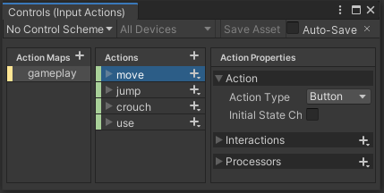

# Workflow Overview - Using an Actions Asset


The Actions Asset provides a way to define, group, and manage sets of actions as data stored in an asset, instead of defining them directly in your code.

Using an Actions Asset allows you to keep the data that defines your actions separate from the GameObjects which should respond to the actions. This provides a further level of abstraction and organization, compared with defining actions in your code.

The Actions Asset is useful because it means all your action definitions are stored as a single asset file, separate from your scripts and prefabs. This can make it simpler to manage conceptually, and can help in practical situations where different people in your team might work on different parts of the project at the same time.

Action Assets also provide other benefits over embedded actions in scripts, such as the ability to group actions into **Action Maps** and **Control Schemes**.

Action Maps are a way to group related actions together, where each map relates to a different situation. For example, your game might involve driving vehicles and navigating on foot, and may have in-game menus. In this example, it would make sense to have three different action maps for each of these three situations, and your game code would switch between them as appropriate. The actions grouped into the "driving" action map might be called "steer", "accelerate", "brake", "handbrake", etc, whereas the actions grouped into the "on foot" action map might be "move", "jump", "crouch", "use", etc. 

The Control Schemes, also defined in an Action Asset, allows you to specify which bindings belong to the control schemes you define. You might have one control scheme which is "Joypad", and another control scheme which is "Keyboard and Mouse". This allows you to determine which control scheme the user is currently using, so your game can respond to the user accordingly. This feature is often used to adapt the in-game UI to show the correct keys or buttons in on-screen prompts.



## Accessing your Actions Asset from code

When you use an Actions Asset, there are two distinct ways to access it from your code. You can either:

* Use an **inspector reference** to the Actions Asset, or
* Generate a **C# class** that wraps your Actions Asset.

Your choice affects how you access your actions from code. With an inspector reference to your Actions Asset, you must read the actions by name using strings. If you use the **Generate C# class** feature, Unity generates an accompanying class as a new **.cs** script asset, which acts as a wrapper for your actions. You can then create an instance of the generated wrapper class in your code and directly use its API members which are named after the names of the actions that you configured.

Both workflow options are described below using the same example, so you can see the difference.

**Referencing the Actions Asset in the inspector**

To use your Actions Asset through an inspector reference:

1. Create a `public InputActionsAsset` field in your script.
2. [Assign the reference](https://docs.unity3d.com/Manual/EditingValueProperties.html#ref-assign-dnd) in the inspector.
3. Access the Actions in your script by name, using strings.

This string-based access is demonstrated in the example below. Note that the reference to the "move" action is stored in a variable after it is found, to avoid 

```
using UnityEngine;
using UnityEngine.InputSystem;

public class DocsExampleActionsAssetReference : MonoBehaviour
{
    // assign the actions asset to this field in the inspector:
    public InputActionAsset actions; 
    
    // private fields
    private InputAction moveAction;

    void Awake()
    {
        // find the "move" action, and keep the reference to it, for use in Update
        moveAction = actions.FindActionMap("gameplay").FindAction("move");

        // for the "jump" action, we add a callback method for when it is performed
        actions.FindActionMap("gameplay").FindAction("jump").performed += OnJump;
    }
    
    void Update()
    {
        // our update loop polls the "move" action value each frame
        Vector2 moveVector = moveAction.ReadValue<Vector2>();
    }

    private void OnJump(InputAction.CallbackContext context)
    {
        // this is the "jump" action callback method
        Debug.Log("Jump!");
    }

    void OnEnable()
    {
        actions.FindActionMap("gameplay").Enable();
    }
    void OnDisable()
    {
        actions.FindActionMap("gameplay").Disable();
    }
}
```

**Referencing the Actions Asset through a C# wrapper**

To use your Actions Asset through an C# wrapper:

1. Select your Actions Asset in the project window
2. In the Inspector, enable **Generate C# Class** and select **Apply**. You should see a C# asset with the same name as your Actions Asset in your project window.
3. Create an instance of your Actions C# class in your script.
3. Access the Actions in your script by using the API of your Actions C# class.

For example:

```
using UnityEngine;
using UnityEngine.InputSystem;

public class DocsExampleActionsAssetCsWrapper : MonoBehaviour
{
    // this field will contain the actions wrapper instance
    ExampleActions actions;
    
    void Awake()
    {
        // instantiate the actions wrapper class
        actions = new ExampleActions();
        
        // for the "jump" action, we add a callback method for when it is performed
        actions.gameplay.jump.performed += OnJump;
    }
    
    void Update()
    {
        // our update loop polls the "move" action value each frame
        Vector2 moveVector = actions.gameplay.move.ReadValue<Vector2>();
    }

    private void OnJump(InputAction.CallbackContext context)
    {
        // this is the "jump" action callback method
        Debug.Log("Jump!");
    }

    void OnEnable()
    {
        actions.gameplay.Enable();
    }
    void OnDisable()
    {
        actions.gameplay.Disable();
    }
}
```

Whether you use the C# wrapper option, or the inspector reference option, using an Action Asset like this gives you the ability to organize and edit your actions in the Actions Window. It is more flexible than using [embedded actions](./Workflow-Embedded.md), and [directly reading device states](./Workflow-Direct.md), and is generally a good solution for many projects. However, you can also add one more step of abstraction using the [**Player Input component**](./Workflow-PlayerInput.md), to set up calls to methods based on your Action definitions. 

See also:

* [Using Action Assets](https://docs.unity3d.com/Packages/com.unity.inputsystem@1.4/manual/ActionAssets.html)

* [Generating a C# Class that wraps your actions](https://docs.unity3d.com/Packages/com.unity.inputsystem@1.4/manual/ActionAssets.html#auto-generating-script-code-for-actions)